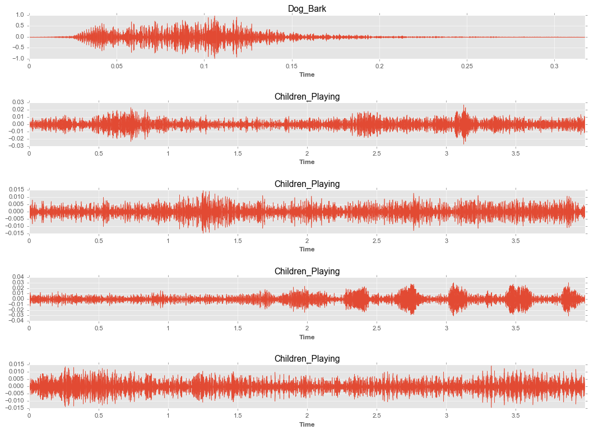
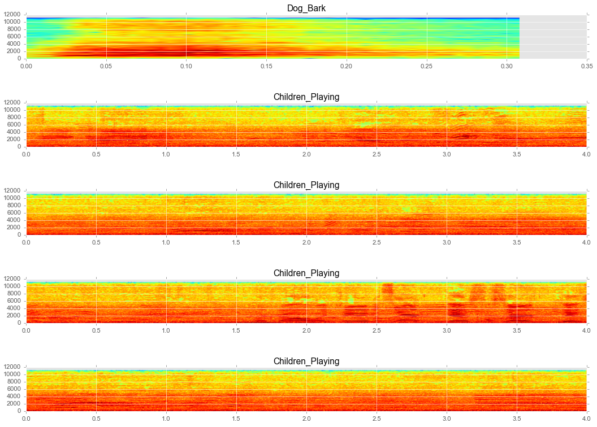
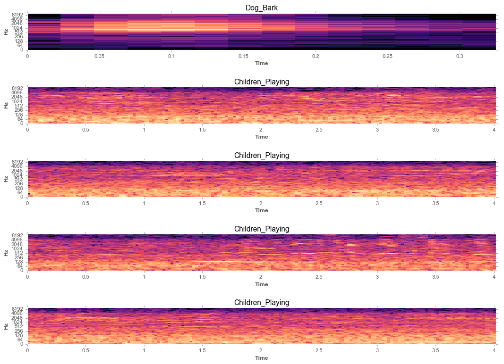

# Audio Classification - Multilayer Neural Networks using TensorFlow

## Summary
85.8% Accuracy,  Input data: 8732 samples of 4s, Test size: 20% of total

## Data Set
[UrbanSound8K](https://serv.cusp.nyu.edu/projects/urbansounddataset/urbansound8k.html)

## Features
	- Audio data extraction to .npz
	- Audio Plot
	- Model checkpoint save to fast compare

## Structure - Summary
<pre>
	/multilayer-neural-network	  - Multilayer 85.80% accuracy
	/neural-network-adam.py       - {Method} xX% accuracy  
</pre>

### Nice explanation How computer looks audio 
[Speech Recognition]https://medium.com/@ageitgey/machine-learning-is-fun-part-6-how-to-do-speech-recognition-with-deep-learning-28293c162f7a#.8pg5nc6tb

## Main Autor
[Haesun Ricky Park](https://github.com/rickiepark/tfk-notebooks/tree/master/urban-sound-classification)

## Downloads
- All: https://github.com/nextco/audio-classification/archive/master.zip