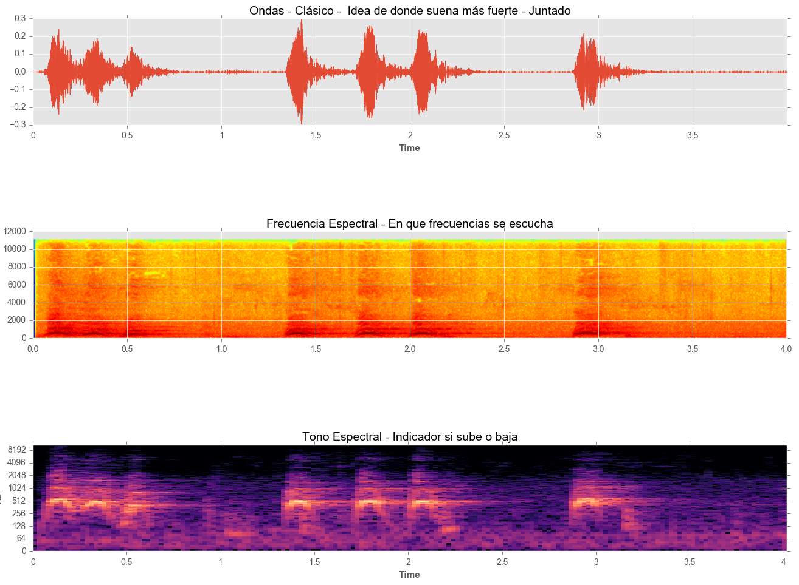
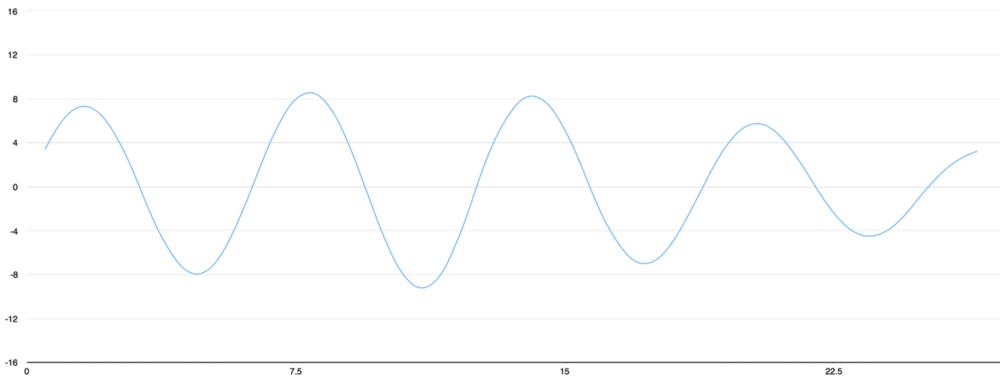

# Audio Classification - Multilayer Neural Networks using TensorFlow

## Summary
82.2% Accuracy,  Input data: 8732 samples of 4s, Test size: 20% of total

## Data Set
[UrbanSound8K](https://serv.cusp.nyu.edu/projects/urbansounddataset/urbansound8k.html)

## Features
	- Audio data extraction to .npz
	- Audio Plot
	- Model checkpoint save to fast compare

## Structure - Summary
<pre>
	/audio-data-extraction/feature-extraction-metadata.py 	- Time execution: 1h 5m
	/audio-data-extraction/feature-extraction-bruteloop.py 	- Time execution: 1h 19m
	/multilayer-neural-network-data-variation.py	  		- Time execution: 11m 48s,  82.2% accuracy
	/multilayer-neural-network.py	  						- Time execution: 13m 17s,  76% accuracy
	/multilayer-neural-network.ipynb	  					- Time execution: 11m  	,   72.7% accuracy

	/neural-network-adam.py       							- {Method} xX% accuracy  
</pre>

### Nice explanation How computer looks audio 
[Speech Recognition]https://medium.com/@ageitgey/machine-learning-is-fun-part-6-how-to-do-speech-recognition-with-deep-learning-28293c162f7a#.8pg5nc6tb

## Main Autor
[Haesun Ricky Park](https://github.com/rickiepark/tfk-notebooks/tree/master/urban-sound-classification)

## Downloads
- All: https://github.com/nextco/audio-classification/archive/master.zip